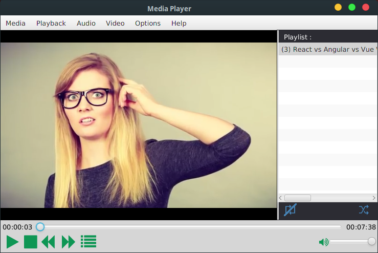
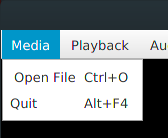
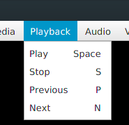
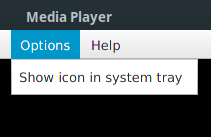

#  Media Player
A JavaFX app that alow users to play audin/vedio files

## What I Learned
- Use the official media library in java
- Use Keyboard shortcuts to control the media player

## Supported Formats
all formats that are suporeted by official media library in java
see (https://docs.oracle.com/javafx/2/api/javafx/scene/media/package-summary.html#SupportedMediaTypes)

- Audio : mp3 , wav , aif
- Viedo : mp4 , flv

## Screenshots 

## To run
1. Download the release file  
2. Make sure you have oracle jre v 8 or higher
3. type in command line or terminal ` java -jar <filename>.jar `
